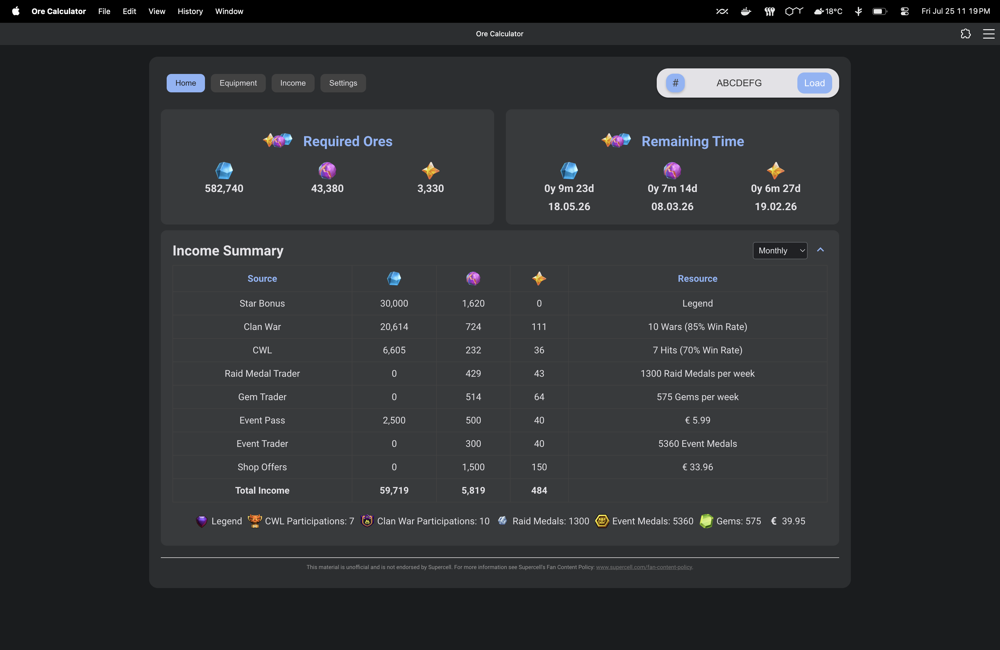

# Ore Calculator for Clash of Clans

[**🚀 Live Application: https://orecalc.tech**](https://orecalc.tech)



## 🌟 Features

This comprehensive Ore Calculator helps Clash of Clans players optimize their hero equipment upgrades and resource management. It provides real-time insights into Shiny, Glowy, and Starry Ore income from various in-game sources.

- **Hero Equipment Ore Calculation:** Determine the exact ore requirements for upgrading your hero equipment.
- **Income Tracking:** Monitor your daily, weekly, and monthly ore income from:
  - Star Bonus
  - Clan Wars
  - Clan War Leagues (CWL)
  - Raid Medal Trader
  - Gem Trader
  - Event Pass
  - Event Trader
  - Shop Offers

- **Player Tag Integration:** Fetch your player data directly from the Clash of Clans API by entering your player tag.
- **Offline Functionality (PWA):** Works as a Progressive Web App (PWA), allowing you to access and use the calculator even without an internet connection after the initial load.
- **Responsive Design:** Optimized for both desktop and mobile devices.

## 🚀 Getting Started

These instructions will get you a copy of the project up and running on your local machine for development and testing purposes.

### Prerequisites

- Node.js (LTS version recommended)
- npm (Node Package Manager)
- Git

### Local Development Setup

1. **Clone the repository:**

    ```bash
    git clone https://github.com/abhis-s/oreCalc.git
    cd oreCalc
    ```

2. **Install dependencies:**

    ```bash
    npm install
    cd server
    npm install
    cd ..
    ```

3. **Set up environment variables for the backend:**
    Copy the example environment file and fill in your Clash of Clans API token:

    ```bash
    cp server/.env.example server/.env
    ```

    Then, open `server/.env` and replace `"YOUR_CLASH_OF_CLANS_API_TOKEN_HERE"` with your actual token.
    For production, the `CLASH_OF_CLANS_API_TOKEN` is sourced from Google Cloud Secret Manager.
    You can obtain an API token from the Clash of Clans Developer Site.

4. **Start the backend API server (in a separate terminal):**

    ```bash
    cd server
    node main.js
    ```

    The server will start on `http://0.0.0.0:3000` (usually localhost:3000, and your local machine IP:port).
    NOTE: Using your local machine IP:port, you can also access the app (here, the API) on another device on the network.

5. **Start the frontend development server:**

    ```bash
    npm run start:dev
    ```

    This will open your app in your browser at `http://0.0.0.0:8080` (usually localhost:8080, and your local machine IP:port) and watch for changes.
    NOTE: Using your local machine IP:port, you can also access the app (here, the API) on another device on the network.

## ☁️ Deployment to Google Cloud

This guide assumes you have a Google Cloud Project set up and the `gcloud` CLI installed and authenticated.

### Requirements

- Google Cloud Project with billing enabled.
- `gcloud` CLI installed and authenticated (`gcloud auth login`, `gcloud config set project YOUR_PROJECT_ID`).
- Enabled APIs:
- Cloud Run API
- Cloud Build API
- Container Registry API (or Artifact Registry API)
- Compute Engine API (for VPC Access)
- Serverless VPC Access API
- Cloud NAT API
- Secret Manager API
- A Clash of Clans API token stored in Google Cloud Secret Manager (e.g., named `clash-of-clans-api-token`).

### Deployment Steps

1. **Build the production-ready frontend assets:**

    ```bash
    npm run build
    ```

    This command will create an optimized `dist/` folder.

2. **Deploy the Backend API to Cloud Run:**
    Navigate to the `server/` directory and deploy your API. Ensure you use the correct region and provide your API token securely from Secret Manager.

    ```bash
    cd server
    gcloud run deploy orecalc-api \
      --source . \
      --region europe-west1 \
      --allow-unauthenticated \
      --platform managed \
      --port 8080 \
      --update-secrets CLASH_OF_CLANS_API_TOKEN=clash-of-clans-api-token:latest
    ```

    *Note: You need a static outbound IP for API whitelisting, ensure your Serverless VPC Access and Cloud NAT setup is complete and your Cloud Run service is configured to use the VPC connector.*

3. **Deploy the Frontend Webapp to Cloud Run:**
    Navigate back to the project root and deploy your frontend.

    ```bash
    cd ..
    gcloud run deploy orecalc-webapp \
      --source . \
      --region europe-west1 \
      --allow-unauthenticated \
      --platform managed \
      --port 80
    ```

4. **Configure Custom Domains (Optional but Recommended):**
    Map your custom domains (e.g., `api.orecalc.tech` for backend, `orecalc.tech` and `www.orecalc.tech` for frontend) via the Google Cloud Console's Cloud Run service settings under the "Custom domains" tab. Follow the instructions to update your DNS records.

5. **Set up CI/CD with Cloud Build (Optional but Recommended):**
    Connect your GitHub repository to Google Cloud Build and create triggers using `cloudbuild.frontend.yaml` and `server/cloudbuild.backend.yaml` to automate deployments on code pushes.

## 🤝 Contributing

Contributions are welcome! Please feel free to open issues or submit pull requests.

## 📄 License

This project is licensed under the MIT License - see the [LICENSE](LICENSE) file for details.
