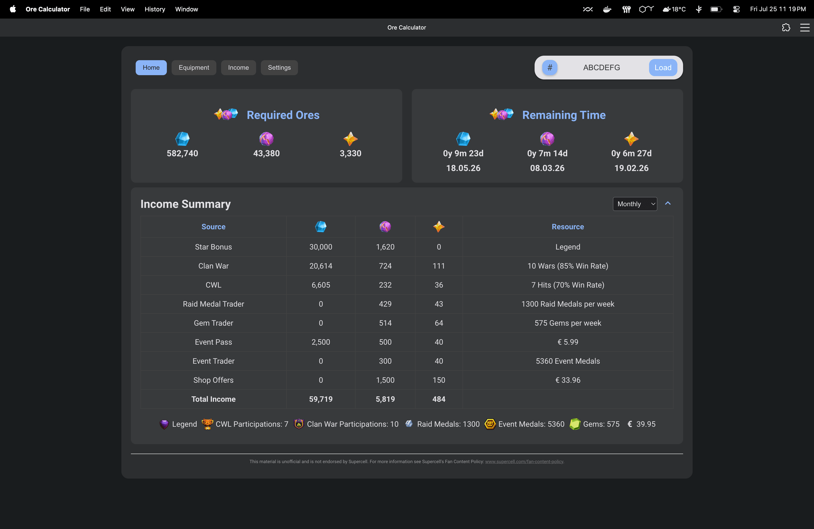
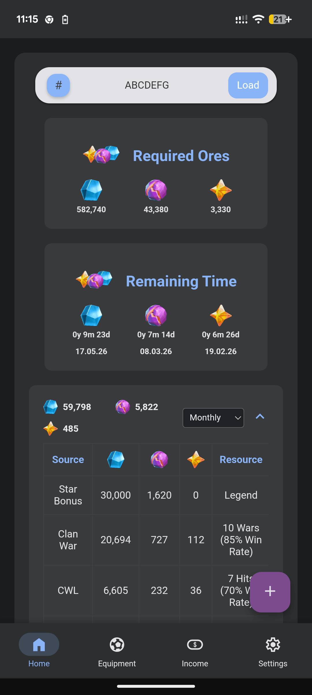

# OreCalc — Clash of Clans Equipment Planner

[**🚀 Live Application: https://orecalc.tech**](https://orecalc.tech)





Stop guessing, start upgrading. **OreCalc** is a comprehensive equipment planner and ore forecasting tool for Clash of Clans. Calculate exactly what you need, track every ore source, plan your upgrades on a visual calendar, and watch your progress in real time.

---

## ✨ Features

### 🏠 Home Dashboard

- **Required Ores** — See exactly how many Shiny, Glowy, and Starry ores you need to reach your target levels
- **Time Remaining** — Real-time estimates of when you'll have enough ores to complete each upgrade, based on your configured income
- **Income Summary Table** — A dynamic table showing ore income per source at your chosen timeframe (daily / weekly / monthly / bimonthly), with totals
- **Resource Overview** — At-a-glance display of your league, CWL participations, Clan War count, Raid Medals, Event Medals, Gems, and total real-money cost

### 🔧 Equipment Tab

- **All 6 heroes** — Barbarian King, Archer Queen, Grand Warden, Royal Champion, Minion Prince, and Dragon Duke with all Common and Epic equipment
- **Per-equipment controls** — Enable or disable individual equipment to include or exclude it from ore calculations
- **Per-hero toggle** — Enable or disable entire heroes at once
- **Stored ores** — Input your currently stored Shiny, Glowy, and Starry ores so the calculator accounts for what you already have
- **Custom max levels** — Set your own target max levels for Common (up to 18) and Epic (up to 27) equipment
- **Hide maxed equipment** — Automatically hide equipment that has already reached the target level
- **Hide locked equipment** — Hide equipment you haven't unlocked yet
- **Level input mode** — Toggle a mode where you can quickly set levels via text input instead of the default selector

### 💰 Income Tab (10 Sources)

Each income source has its own dedicated card with inputs and a detailed breakdown of ore output per timeframe (daily / weekly / monthly / bimonthly).

- **Star Bonus** — Select your league from every tier (Skeleton through Legend). Configure multiplier events (2x / 4x) with custom event frequency and duration. Plan for TH upgrades that change your league floor mid-timeline
- **Clan Wars** — Set wars per month, win/draw/loss rates, and ores earned per attack. Inputs feature TH-based recommended values pulled from in-game data
- **Clan War Leagues (CWL)** — Set hits per season with win/draw/loss rates and per-attack ore income
- **Raid Medal Trader** — Configure how many packs of each ore type you buy weekly with your earned Raid Medals
- **Gem Trader** — Configure weekly gem pack purchases for each ore type
- **Event Pass** — Toggle between free and paid pass. Set claimable medals and bonus track medals. Optionally include equipment rewards in the calculation
- **Event Trader** — Configure medal-based ore purchases. Dynamic recommendations show how many packs you can afford based on your remaining Event Medals after other purchases
- **Shop Offers** — Select your TH-level offer set. Toggle individual offers on/off. Tracks the real-money cost in your chosen currency
- **Supercell Events** — Toggle World Championship events. Dynamic schedule with auto-generated income chips based on the current season
- **Prospector** — Configure ore conversion (e.g. Shiny → Glowy). Gold Pass vs. Silver Pass rates. A dynamic recommendation tip analyzes your bottleneck ore and suggests the optimal conversion to reach your next upgrade faster, with over-conversion warnings

Every number input features a **contextual popover** with min/max ranges, TH-based recommended values, and click-to-fill buttons for quick setup.

### 📅 Planner Tab

- **Calendar** — Monthly and weekly views with swipe/drag navigation. Configurable first day of week (auto / Monday / Sunday)
- **Income chips** — Each income source generates draggable chips placed on calendar days. Chips show ore amounts and source icons. Supports daily, weekly, monthly, and bimonthly schedules
- **Auto-place** — One-click automatic distribution of all income chips across the visible month or entire year
- **Custom chips** — Create your own chips via a full modal with 11 chip types (Star Bonus, Shop Offers, Gem Trader, Raid Medal Trader, Event Trader, Event Pass, Clan War, CWL, Supercell Events, Prospector, and a freeform "Extras" type). Custom chips support one-time or recurring schedules (weekly / monthly)
- **Chip management** — Drag and drop chips between calendar days. Delete chips. Delete all chips for a month or globally
- **Priority list** — Sortable upgrade queue that determines the order in which ores are allocated. Shows target level and estimated completion date for each item
- **Priority list editor** — Full modal to add, remove, and reorder equipment in the priority queue. Includes smart ordering suggestions based on ore efficiency
- **Efficiency interleaving** — The priority list suggests completing cheaper Common upgrades during Starry ore bottlenecks to keep your Shiny and Glowy ores productive
- **Ore tooltips** — Hover over any priority item to see the exact ore cost breakdown and which ore type is the bottleneck
- **Hide/show suggestions** — Dismiss or restore priority list suggestions as needed

### 👤 Multi-Player & Sync

- **Clash of Clans API** — Enter your player tag to fetch your profile, Town Hall level, heroes, and equipment levels directly from the game. Clan badge displayed in the UI
- **Multi-account support** — Save multiple player tags and switch between them via a dropdown. Each account maintains its own heroes, income settings, planner, and currency preferences
- **Real-time cloud sync** — Data is automatically synced to Firestore on every change. Load your data on any device by entering your User ID
- **QR code sharing** — Generate a QR code for your User ID. Scan it on another device to instantly import your data
- **Data download** — Export all your data as a downloadable file
- **User ID import** — Import another player's data by pasting their User ID
- **Tag verification** — Verify tag ownership via Clash of Clans API token for protected profiles
- **Danger zone** — Reset all data or request global data erasure (GDPR-compliant deletion)

### 🎨 Customization & Settings

- **Accent color themes** — Choose from Blue, Gold, Purple, Green, Red, or Random. The entire UI adapts to your choice
- **Dark / Light mode** — Toggle between dark and light themes
- **9 currencies** — EUR, USD, GBP, AUD, CAD, CHF, INR, JPY, NZD. All real-money cost calculations (Shop Offers, Event Pass, Prospector) update to your chosen currency
- **Global pricing** — Customize prices per currency if your region's pricing differs from defaults
- **Localization** — English and German with automatic browser locale detection. All labels, dates, and number formatting adapt to your language
- **Calendar settings** — First day of week, chip icon visibility, auto-place scope (month / year)
- **Responsive design** — Fully optimized for desktop, tablet, and mobile
- **Progressive Web App** — Install to your home screen, works fully offline after the first load
- **Completely ad-free** — No ads, no tracking, no paywalls. Open source and free forever
- **Changelog** — In-app changelog modal shows what's new after each update

---

## 🚀 Getting Started

### Prerequisites

- [Node.js](https://nodejs.org/) (LTS version recommended)
- [pnpm](https://pnpm.io/) (Performant NPM package manager)
- [Git](https://git-scm.com/)

### Local Development Setup

1. **Clone the repository:**

    ```bash
    git clone https://github.com/abhis-s/oreCalc.git
    cd oreCalc
    ```

2. **Install dependencies:**

    This is a pnpm workspace — one command installs both frontend and backend dependencies:

    ```bash
    pnpm install
    ```

3. **Set up environment variables:**

    Copy the example env file and configure it:

    ```bash
    cp server/.env.example server/.env
    ```

    Edit `server/.env` and set:
    - `CLASH_OF_CLANS_API_TOKEN` — Your API token from the [Clash of Clans Developer Portal](https://developer.clashofclans.com/)
    - `FIRESTORE_SA_KEY` — *(Optional)* Google Cloud Firestore service account key for cloud sync
    - `COC_API_BASE_URL` — *(Optional)* Override the API base URL. Defaults to the [RoyaleAPI proxy](https://cocproxy.royaleapi.dev) which removes the need for a static IP

4. **Start the backend API server** (in a separate terminal):

    ```bash
    cd server
    node main.js
    ```

    The server starts on `http://0.0.0.0:3000`. You can access it from other devices on the same network using your local IP.

5. **Start the frontend dev server:**

    ```bash
    pnpm dev
    ```

    Opens at `http://0.0.0.0:8080` with hot-reload. Also accessible from other devices on the network.

---

## ☁️ Deployment

### Google Cloud Run

This project is designed for deployment on Google Cloud Run with CI/CD via Cloud Build.

#### Requirements

- Google Cloud Project with billing enabled
- `gcloud` CLI installed and authenticated
- Enabled APIs: Cloud Run, Cloud Build, Artifact Registry, Serverless VPC Access, Cloud NAT, Secret Manager
- Clash of Clans API token stored in Secret Manager (e.g., named `clash-of-clans-api-token`)

#### Deploy Steps

1. **Build frontend:**

    ```bash
    pnpm run build
    ```

2. **Deploy backend:**

    ```bash
    cd server
    gcloud run deploy orecalc-api \
      --source . \
      --region europe-west1 \
      --allow-unauthenticated \
      --platform managed \
      --port 8080 \
      --update-secrets CLASH_OF_CLANS_API_TOKEN=clash-of-clans-api-token:latest
    ```

    > **Note:** If using the official Clash API directly (not the RoyaleAPI proxy), you need a static outbound IP via Serverless VPC Access + Cloud NAT.

3. **Deploy frontend:**

    ```bash
    cd ..
    gcloud run deploy orecalc-webapp \
      --source . \
      --region europe-west1 \
      --allow-unauthenticated \
      --platform managed \
      --port 80
    ```

4. **Custom domains** *(recommended)* — Map `orecalc.tech` and `api.orecalc.tech` via Cloud Run's custom domain settings.

5. **CI/CD** *(recommended)* — Connect your GitHub repository to Cloud Build using `cloudbuild.frontend.yaml` and `server/cloudbuild.backend.yaml`.

---

## 🏗️ Architecture

```text
oreCalc/
├── assets/              # Hero images, ore icons, resource images
├── css/                 # SCSS design system (palette, components, pages)
├── js/
│   ├── app.js           # Entry point and initialization
│   ├── components/      # UI components (equipment, income, planner, settings)
│   ├── core/            # State management, calculator, renderer
│   ├── data/            # Hero data, income source registry, pricing
│   ├── dom/             # DOM element selectors
│   ├── i18n/            # Translation files (en.json, de.json)
│   ├── incomeCalculations/  # Income calculation logic per source
│   ├── services/        # API services, cloud sync, changelog
│   ├── ui/              # Toast, modals, saving indicator
│   └── utils/           # Chip factory, validators, date utils, SVG manager
├── partials/            # HTML templates (tabs, modals, navigation)
├── server/              # Express.js API (player data, verification, sync)
└── pnpm-workspace.yaml  # Workspace configuration
```

---

## 🤝 Contributing

Contributions are welcome! Feel free to:

- 🐛 [Open an issue](https://github.com/abhis-s/oreCalc/issues) for bugs or feature requests
- 🌐 [Help translate on Crowdin](https://crowdin.com/project/orecalc) to add new languages
- ☕ [Buy me a coffee](https://buymeacoffee.com/orecalc) to support development

## 📄 License

This project is licensed under the MIT License — see the [LICENSE](LICENSE) file for details.
