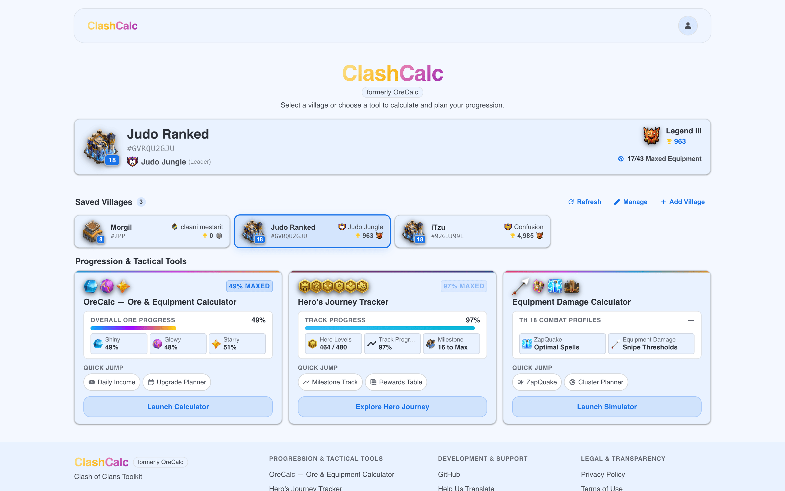
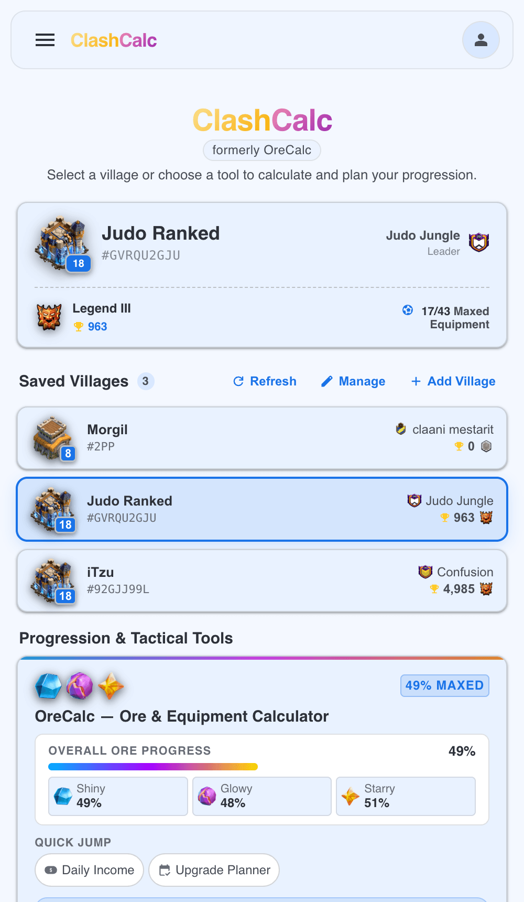
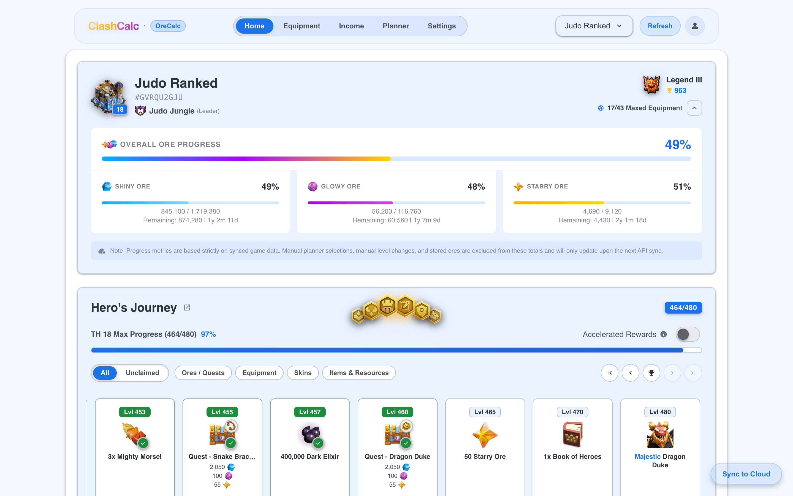
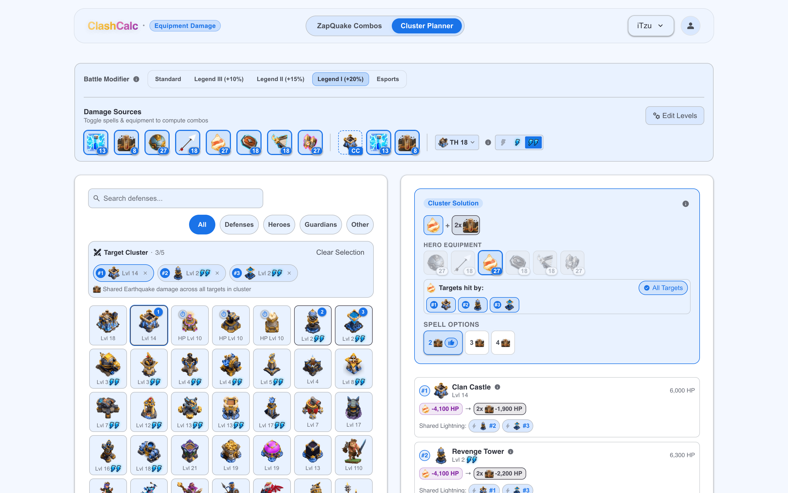
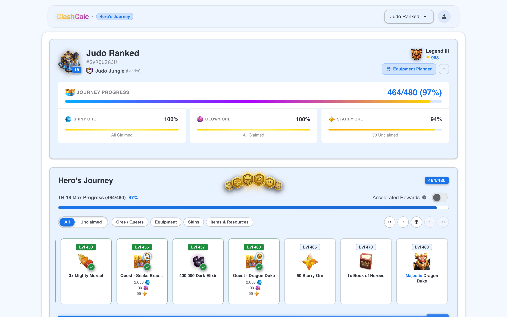

# ClashCalc — Clash of Clans Tactical & Progression Suite

[**Live Application: https://clashcalc.com**](https://clashcalc.com)

> **Notice**: ClashCalc was previously hosted at `orecalc.tech`. All player profiles, stored data, and configurations migrate seamlessly to `clashcalc.com`.



A high-performance, privacy-first web application suite engineered for Clash of Clans planning, upgrade forecasting, and tactical attack calculation. Completely ad-free, open-source, and fully functional offline as a Progressive Web App (PWA).

---

## Capabilities

| Tool | Focus & Mechanics | Key Capabilities |
| :--- | :--- | :--- |
| **Landing Portal** | Multi-village hub & suite launchpad | Instant village switching, live progress metrics, Town Hall level and league tracking, and direct navigation across tools. |
| **Ore Calculator** | Upgrade scheduling & inventory modeling | Exact ore requirements (Shiny, Glowy, Starry) across hero equipment, stored blacksmith inventory deductions, customizable target level caps, and time-to-max forecasts. |
| **Income Engine** | Recurring & event resource modeling | 10 modeled income channels (Star Bonus multiplier events, Clan Wars, CWL, Raid Medals, Gem Trader, Event Pass, Event Trader, Shop Offers, Supercell Tournaments, Prospector conversion optimizer). |
| **Calendar Planner** | Visual timeline & upgrade ordering | Draggable income chips across daily, weekly, monthly, and bimonthly schedules, one-click auto-placement across month or year, and a priority upgrade queue with bottleneck interleaving. |
| **Damage Calculator** | ZapQuake & hero ability destruction solver | Minimal spell and active ability combinations required to destroy target structures, Pareto-optimal superset pruning, damage profiles for active abilities, building HP & supercharge tier modeling. |
| **Cluster Planner** | Multi-target area tactical planning | Select 2 to 5 target defenses to calculate combined burst damage solutions and spell thresholds across defense clusters. |
| **Hero's Journey** | Milestone progression & reward resolver | Milestone track visualization, quest chest yield models across Town Hall levels, and deterministic equipment unlock and Starry Ore fallback resolution. |

---

## Visual Showcase

<details>
<summary><strong>Expand Interface Gallery (Tool Previews & Mobile Layout)</strong></summary>
<br>

| Multi-Village Portal (Desktop) | Mobile Responsive Layout |
| :---: | :---: |
|  |  |

| Ore Calculator & Upgrade Forecasting | Damage Calculator & Cluster Planner |
| :---: | :---: |
|  |  |

| Hero's Journey Milestone Tracker |
| :---: |
|  |

</details>

---

## Interface, Customization & Privacy

- **Themes & Accent Colors**: Full Dark theme and Light theme support, paired with 5 cohesive accent color palettes (Blue, Gold, Purple, Green, Red) and an optional session Randomizer.
- **Card Layout Modes**: Switch between Cozy and Compact display density depending on your device and preference.
- **Multi-Currency Pricing**: Real-time cost calculations across 11 currencies (EUR, USD, GBP, AUD, CAD, CHF, CNY, INR, JPY, NZD, TRY) with custom regional price overrides.
- **Multilingual Localization**: Native support for English, Deutsch, Türkçe, and Chinese (Simplified), with automatic browser locale detection.
- **Privacy & Security**: Zero tracking cookies, 100% self-hosted zero-CDN UI assets, privacy-preserving cookie-free Cloudflare analytics & Turnstile bot defense, client-side DOM sanitization, Passkeys / WebAuthn passwordless authentication, Google Cloud Firestore cloud synchronization, QR code device linking, and self-service cloud data erasure and account deletion.

---

## Local Development

### Prerequisites

- [Node.js](https://nodejs.org/) (v22+ recommended)
- [pnpm](https://pnpm.io/) (v11+ required)
- [Git](https://git-scm.com/)

### Setup Instructions

1. **Clone the repository:**

   ```bash
   git clone https://github.com/abhis-s/oreCalc.git
   cd oreCalc
   ```

2. **Install workspace dependencies:**

   ClashCalc uses a `pnpm` monorepo workspace (`pnpm-workspace.yaml`). A single command installs all frontend and backend dependencies:

   ```bash
   pnpm install
   ```

3. **Configure environment variables:**

   Copy the template environment files:

   ```bash
   cp .env.example .env
   cp server/.env.example server/.env
   ```

   Key configuration settings in `server/.env`:
   - `CLASH_OF_CLANS_API_TOKEN`: Your API token from the [Clash of Clans Developer Portal](https://developer.clashofclans.com/).
   - `COC_API_BASE_URL`: *(Optional)* API base URL override. Defaults to the [RoyaleAPI proxy](https://cocproxy.royaleapi.dev), which removes the need for a static IP address.
   - `FIRESTORE_SA_KEY`: *(Optional)* Google Cloud Firestore service account JSON string for cross-device cloud sync.

4. **Start the development servers:**

   - **Frontend & Watchers** (runs live dev server, SCSS compilation, and JS bundler on `http://localhost:8080`):

     ```bash
     pnpm dev
     ```

   - **Backend API Server** (runs Express proxy on `http://localhost:3000`):

     ```bash
     pnpm --filter orecalc-server start
     ```

5. **Execute verification test suites:**

   ```bash
   pnpm test
   ```

6. **Build for production:**

   ```bash
   pnpm run build
   ```

---

## Deployment

### Continuous Deployment (Google Cloud Run)

ClashCalc is deployed to Google Cloud Run using automated commit-based triggers via Google Cloud Build.

- **Frontend Service (`orecalc-webapp`)**: Triggered on repository commits, executes `cloudbuild.frontend.yaml` to build static assets, package the container, and deploy to Cloud Run. Mapped to `clashcalc.com`.
- **Backend Service (`orecalc-api`)**: Triggered on changes in `server/`, executes `server/cloudbuild.backend.yaml` to containerize the Express API, inject secrets from Google Cloud Secret Manager, and deploy to Cloud Run. Mapped to `api.clashcalc.com`.
- **Secret Manager Bindings**: Production deployments bind secrets dynamically (`CLASH_OF_CLANS_API_TOKEN`, `FIRESTORE_SA_KEY`, `JWT_SECRET`, `TURNSTILE_SECRET_KEY`, `SMTP_PASS`).

### Manual CLI Deployment (Self-Hosting)

For standalone environments or manual deployments without automated triggers:

1. **Build frontend assets:**

   ```bash
   pnpm run build
   ```

2. **Deploy backend service:**

   ```bash
   cd server
   gcloud run deploy orecalc-api \
     --source . \
     --region europe-west1 \
     --allow-unauthenticated \
     --platform managed \
     --port 8080 \
     --update-secrets CLASH_OF_CLANS_API_TOKEN=clash-of-clans-api-token:latest
   ```

3. **Deploy frontend service:**

   ```bash
   cd ..
   gcloud run deploy orecalc-webapp \
     --source . \
     --region europe-west1 \
     --allow-unauthenticated \
     --platform managed \
     --port 80
   ```

---

## Architecture

The application is structured into a 4-tier unidirectional dependency architecture (Data -> Domain -> Core -> UI):

```text
OreCalc/
├── assets/              # Optimized game assets (buildings, equipment, heroes, spells)
├── css/                 # Sass design system (palette tokens, components, pages)
├── js/
│   ├── landingApp.js    # Multi-tool landing portal and village switcher
│   ├── app.js           # Ore Calculator single-page application
│   ├── heroJourneyApp.js# Hero's Journey tracker
│   ├── damageApp.js     # ZapQuake & damage solver
│   ├── components/      # UI components (Display renderers & Input controllers)
│   ├── core/            # State management, storage partitioning, migrations
│   ├── domain/          # Pure calculation algorithms and combinatorial solvers
│   ├── data/            # Static game metadata, levels, and pricing data
│   ├── i18n/            # Localization dictionaries (en, de, tr, zh)
│   ├── services/        # Clash API client, WebAuthn passkeys, Firestore sync
│   └── utils/           # Shared utilities (math, dates, SVG sprites, popovers)
├── partials/            # Compile-time HTML partials and modal templates
├── server/              # Express API server (proxy, caching, rate limiting, auth)
├── tests/               # Core and domain unit test suites
└── pnpm-workspace.yaml  # Workspace configuration
```

---

## Community & Contributing

Contributions, bug reports, and suggestions are welcome:

- [Open an Issue](https://github.com/abhis-s/oreCalc/issues) for bug reports and feature requests.
- [Crowdin Project](https://crowdin.com/project/orecalc) to help translate the application into new languages.
- Read [CONTRIBUTING.md](CONTRIBUTING.md) for architectural guidelines, component conventions, and testing requirements.
- Review [SECURITY.md](SECURITY.md) for vulnerability disclosure procedures and supported releases.

---

## License

This project is licensed under the MIT License — see the [LICENSE](LICENSE) file for details.
