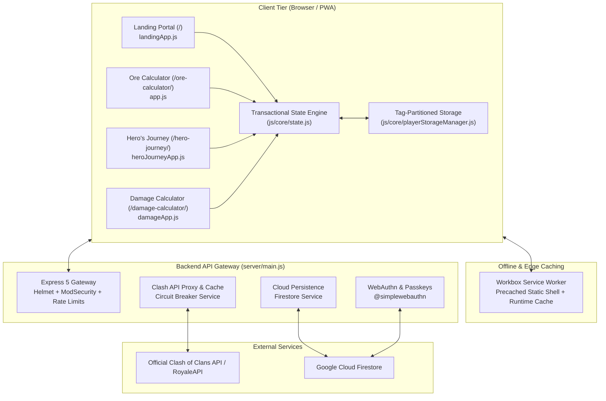

# ClashCalc — System Architecture & Design Specification

This document provides a comprehensive architectural breakdown of the **ClashCalc** application suite. It outlines the design patterns, dependency tiers, persistence model, domain solvers, and security mechanisms governing the codebase.

---

## 1. High-Level System Architecture

ClashCalc is organized as a multi-tool progressive web application suite powered by a lightweight Node.js Express API gateway.



---

## 2. Four-Tier Unidirectional Dependency Architecture

To maintain strict modularity and prevent circular dependency cycles, all client-side code adheres to a 4-tier unidirectional dependency contract:

$$\text{Tier 1: Data} \longrightarrow \text{Tier 2: Domain} \longrightarrow \text{Tier 3: Core} \longrightarrow \text{Tier 4: UI / Components}$$

```text
js/
├── data/        [Tier 1: Static Game Constants & Metadata]
├── domain/      [Tier 2: Pure Mathematical Algorithms & Solvers]
├── core/        [Tier 3: State Management, Storage & Migrations]
└── components/  [Tier 4: UI Display Renderers & Input Controllers]
```

### Tier 1: Static Data (`js/data/`)
- Contains immutable databases, level curves, and equipment stat tables (`equipmentData.js`, `buildingsData.js`, `spellsData.js`, `heroesData.js`).
- Contains zero dynamic dependencies, DOM queries, or runtime mutations.

### Tier 2: Pure Domain Engines (`js/domain/`)
- Houses referentially transparent mathematical algorithms and solvers:
  - `zapQuakeSolver.js`: Combinatorial and Pareto-optimal spell and ability solver.
  - `damageEngine.js`: Building HP calculations, supercharge scaling, and strike diminution.
  - `oreCalculator.js`: Upgrade cost summation and requirement deductions.
  - `heroJourneyResolution.js`: Deterministic milestone reward resolution and Starry Ore substitution.
  - `recurringEngine.js`: Calendar chip scheduling and anchor-date shifting.
- **Invariant**: Domain modules must never reference the DOM, `localStorage`, or external network APIs. Given identical inputs, they produce identical outputs.

### Tier 3: Core Subsystems (`js/core/`)
- Manages application lifecycle, persistence, and state transitions:
  - `state.js`: Global reactive state object and subscription dispatch.
  - `playerStorageManager.js`: Multi-tenant key partitioning and localStorage serialization.
  - `stateCleanup.js`: Idempotent schema migrations and backward compatibility.
  - `themeManager.js`: Dynamic color interpolation, theme transitions, and CSS custom property injection.

### Tier 4: UI & Components (`js/components/`)
- Divided strictly into two complementary archetypes:
  - `*Display.js`: Pure DOM construction modules that take data objects and return markup strings or DOM trees. Never attach event listeners in display modules.
  - `*Inputs.js`: Interactive controllers that bind event listeners, perform validation, and invoke `handleStateUpdate()`.

---

## 3. Multi-Tenant Storage Partitioning

To support fast switching across multiple player accounts without cloning or re-serializing the entire application state tree, storage is partitioned by sanitized player tag:

```text
localStorage Key Schema:
├── clashCalc_playerTags         -> Array<string> (Registered player tags)
├── clashCalc_player_<TAG>       -> JSON Object (Heroes, equipment levels, income settings)
├── clashCalc_planner_<TAG>      -> JSON Object (Custom calendar chips & overrides)
├── clashCalc_history_<TAG>      -> JSON Object (Past month logs & milestone history)
├── clashCalc_appSettings        -> JSON Object (Theme, accent color, currency, locale)
└── clashCalc_userId             -> UUID string (Cloud sync identifier)
```

- When switching villages via the account dropdown, the active partition is loaded in $O(1)$ time.
- Changes are written synchronously to the active tag partition and broadcast across browser tabs using the native `StorageEvent` listener.

---

## 4. Combinatorial Solvers & Tactical Algorithms

### ZapQuake & Hero Ability Solver (`zapQuakeSolver.js`)
The solver computes the minimal spell and hero ability investment needed to destroy defensive targets:
1. **Candidate Generation**: Evaluates player-enabled spells (Lightning, Earthquake, donated Clan Castle spells) and active hero abilities (Fireball, Giant Arrow, Spiky Ball, Seeking Shield, Flame Blower, Rocket Backpack).
2. **Diminishing Returns Modeling**: Computes consecutive Earthquake strikes using the in-game formula:
   $$\text{Damage}(N) = \left\lfloor \text{MaxHP} \times \frac{\text{BasePct}}{2N - 1} \right\rfloor$$
3. **Pareto-Optimal Superset Pruning**: Discards redundant combinations. If combination $A$ destroys structure $T$, any combination $B \supset A$ is eliminated as unnecessary overkill.
4. **Dominance Partitioning**: Ranks solutions by spell housing space, ability usage, and total strikes to present the most efficient attack recipes.

### Cluster Planner
Allows attackers to define a spatial cluster of 2 to 5 high-value defenses (e.g., Monolith, Clan Castle, and Super Wizard Towers) to calculate unified multi-target destruction solutions via area damage abilities (such as Warden Fireball) combined with residual ZapQuake strikes.

---

## 5. Security & Gateway Architecture

The Express server (`server/main.js`) acts as a secure, hardened proxy gateway:

- **ModSecurity & Helmet**: Enforces strict Content Security Policy (CSP), clickjacking defenses (`X-Frame-Options: SAMEORIGIN`), and MIME-type enforcement (`X-Content-Type-Options: nosniff`).
- **Cloudflare Turnstile**: Protects authentication and registration endpoints against automated bot networks and credential stuffing.
- **Passkeys / WebAuthn**: FIDO2-compliant passwordless authentication powered by `@simplewebauthn/server` and `@simplewebauthn/browser`.
- **Circuit Breaker & Caching**: Wraps outbound requests to the Clash of Clans API with an in-memory TTL cache and an automated circuit breaker to protect against upstream rate-limiting and service outages.
- **Self-Service Data Erasure**: Endpoints enforce ownership boundaries: anonymous data erasure (`DELETE /api/delete/:userId`) requires the user's secret sync UUID, while full account deletion (`DELETE /api/auth/account`) enforces WebAuthn session authentication to cascade permanent Firestore deletion.
