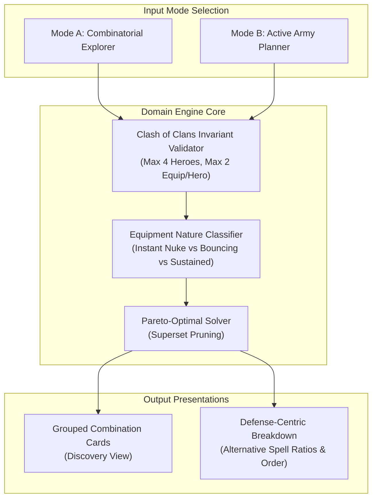

# Clash of Clans ZapQuake & Hero Equipment Solver: Architectural & Algorithmic Analysis

This document provides a comprehensive technical breakdown of how computational tools solve building destruction combinations using **Spells** (Lightning & Earthquake) and **Hero Equipment** in Clash of Clans. It is designed as an architectural briefing for an autonomous reasoning agent with no prior exposure to this specific repository or source files.

---

## 1. Domain Overview & Problem Statement

In Clash of Clans, competitive and casual players often plan attacks by destroying high-value defensive structures (e.g., Town Hall, Monolith, Eagle Artillery, Clan Castle, Ricochet Cannons, Air Defenses) before deploying their main army.

Historically, this was achieved solely through **ZapQuake** (combinations of Lightning Spells and Earthquake Spells). The introduction of **Hero Equipment** added active hero abilities that deal massive direct damage (e.g., Fireball, Giant Arrow, Spiky Ball, Seeking Shield), allowing players to soften or completely destroy structures before or alongside casting spells.

### The Computational Challenge
Given:
1. A base of defensive structures with specific Hitpoints (HP), levels, and Supercharge tiers.
2. A pool of player-enabled Spells with defined damage formulas and housing space costs.
3. A pool of player-enabled Hero Equipment with specific damage values, levels, and delivery mechanics.
4. Battle modifiers (e.g., Esports mode or Normal mode with stat adjustments).

**The goal is to calculate the optimal, minimal, or viable combination of Spells and Hero Equipment required to destroy target structures, while minimizing housing space and respecting game invariants.**

---

## 2. In-Game Mechanics & Equipment Taxonomy

A critical flaw in naive solvers is treating all damage sources as identical point-blank burst nukes. In reality, damage sources in Clash of Clans have fundamentally different mechanical profiles.

### A. Spells
- **Lightning Spell (Zap)**:
  - **Cost**: 1 Housing Space.
  - **Mechanic**: Flat direct damage in a small radius.
  - **Immunities**: Town Hall and Clan Castle are 100% immune to Lightning damage. All resource storages are immune.
- **Earthquake Spell (EQ)**:
  - **Cost**: 1 Housing Space.
  - **Mechanic**: Percentage-based damage of the structure's **maximum HP** with diminishing returns per consecutive strike:
    $$\text{Damage}(N) = \left\lfloor \text{MaxHP} \times \frac{\text{BasePct}}{2N - 1} \right\rfloor$$
    where $N$ is the strike sequence ($1, 2, 3\dots$).
  - **Wall Breaker Rule**: 4 Earthquake spells of any level destroy walls of any level instantly (100% damage).
  - **Immunities**: Storages and Blacksmith are immune.

### B. Hero Equipment Taxonomy

In real gameplay, a player can field **at most 4 Heroes** in an attack, and each hero can equip **at most 2 pieces of equipment** (maximum 8 equipped items across the army, of which only a fraction deal active direct damage). Furthermore, the delivery mechanics differ substantially:

| Equipment | Hero | Damage Nature | In-Game Delivery Profile | Sniping / Pre-Attack Viability |
| :--- | :--- | :--- | :--- | :--- |
| **Fireball** | Grand Warden | Massive Concentrated Area Burst | Warden triggers ability; launches an instantaneous massive blast (up to 4,100 HP) centered on his target or a dense building cluster. | **Ideal**: Can be targeted from outside the base with proper Warden positioning. |
| **Giant Arrow** | Archer Queen | Full-Map Linear Piercing Projectile | Queen fires an arrow across the entire map in a straight line, dealing flat damage (up to 2,150 HP, dealing $2\times$ damage against Air Defenses). | **Ideal**: Global reach; can snipe 2 Air Defenses from the deployment boundary. |
| **Spiky Ball** | Barbarian King | Chained Bouncing Projectile | King activates ability; launches a ball that ricochets across 6 to 8 nearest targets, dealing flat damage (up to 3,000 HP) per bounce. | **Conditional**: First bounce is predictable, subsequent bounces depend on base topology and nearby trash buildings. |
| **Seeking Shield** | Royal Champion | Chained Bouncing Projectile | Champion throws her shield, bouncing across 4 defenses for flat damage (up to 2,500 HP). | **Conditional**: Targets defenses only, but pathing depends on defensive proximity. |
| **Flame Blower / Rocket Backpack / Meteor Staff** | Dragon Duke / Minion Prince / Warden | Targeted Splash Bursts | Area splash damage (2,150–2,500 HP) delivered to immediate targets. | **Moderate**: Delivered upon hero activation or engagement. |
| **Rocket Spear** | Royal Champion | Sustained Combat Buff (Multi-Shot) | Grants the Royal Champion extended range and 8 to 10 consecutive spear attacks dealing bonus flat damage per shot (up to 980 per spear). | **Non-Instant / Combat Dependent**: Total potential damage across all 10 shots is $9{,}800$, but this requires the hero to spend several seconds firing individual attacks during live combat. It is **not** an instant pre-attack burst. |
| **Earthquake Boots** | Barbarian King | Percentage Ground Stomp | Percentage-based stomp around the King that breaks walls and advances the Earthquake diminishing returns counter. | **Melee Range**: Requires the King to walk up to the target. |

---

## 3. Comparison of Three Solving Approaches

### Approach 1: The Pure Combinatorial Sandbox (Clashify)

#### Architectural Concept
Clashify treats all enabled damage sources (up to 6 equipment and 2 spells) as an unconstrained mathematical pool. It generates all possible mathematical subsets and displays cards grouped by identical combinations.

#### The Algorithm
1. **Power Set of Equipment**:
   Generates the power set ($2^N$) of all enabled equipment. Each equipment can be used 0 or 1 time. For 6 enabled equipments, this yields 64 combinations.
2. **Spell Compositions**:
   Generates all valid combinations of Lightning and Earthquake spells from 0 up to 15 spell housing space.
3. **Cartesian Product**:
   Computes the Cartesian product of equipment subsets and spell compositions, ordered by total usage complexity:
   $$\text{Complexity} = \text{Total Usages} \rightarrow \text{Spell Slots} \rightarrow \text{Equipment Uses}$$
4. **Target Evaluation with Pareto-Optimal Superset Pruning**:
   For each target building, candidate combinations are tested in ascending complexity order:
   - If combination $A$ destroys target $T$, any subsequent candidate combination $B$ that is a strict superset of $A$ ($B \supset A$) is **discarded as redundant overkill**.
   - Example: If `Giant Arrow` alone destroys an Air Sweeper, then `Giant Arrow + 1 Zap` or `Giant Arrow + Fireball` is discarded for the Air Sweeper.
   - For high-HP structures that survive any single equipment (like Town Hall or Monolith), multi-equipment combinations (e.g., `Fireball + Rocket Backpack` or `Giant Arrow + Fireball + Rocket Backpack`) survive pruning because no subset of them was sufficient.
5. **Grouping by Combination**:
   Buildings that share the exact same minimal solution are clustered into consolidated UI cards (e.g., a card showing `Fireball + Rocket Backpack` listing Eagle Artillery, Monolith, and Ricochet Cannon).

#### Strengths
- **Discovery**: Uncovers non-obvious synergistic combinations across different heroes (e.g., pairing a Queen Giant Arrow with a Warden Fireball to wipe out a core cluster without using any spells).
- **Consolidated UI**: Grouping defenses under combinations provides a clean visual overview of what a single combination achieves across the entire base.

#### Weaknesses & Limitations
- **Impossible In-Game Scenarios**: Because it does not enforce Clash of Clans army rules, it generates theoretical fantasy combinations (e.g., combining 5 heroes' active abilities on a single building: King + Queen + Warden + Champion + Minion Prince).
- **Spatial / Tactical Disconnect**: Assumes all selected abilities hit the exact same building simultaneously, ignoring travel lines, bounce ranges, and deployment restrictions.
- **Combinatorial Explosion**: As additional equipment sources are enabled, the search space grows exponentially ($O(2^N \cdot S)$), necessitating warning banners about browser lag.

---

### Approach 2: The Tactical Loadout Planner (COC Damage Calculator)

#### Architectural Concept
COC Damage Calculator takes an attack-preparation approach. Rather than solving across all existing items in the game, it requires the user to declare their **active hero loadout** (e.g., "I am bringing Giant Arrow Lvl 18 and Fireball Lvl 27").

#### The Algorithm
1. **Pre-Damage Application**:
   Applies the exact damage of the user's declared equipment setup to all target defenses.
2. **Execution Order Modeling**:
   Explicitly models strike order (e.g., `Earthquake Spell first` vs `Earthquake Boots first`) to account for percentage diminishing returns against current HP.
3. **Zero-Spell Check**:
   If the user's declared equipment destroys the defense directly, it marks the defense as "Destroyed by equipment alone (0 spells)".
4. **Residual Spell Solver**:
   If the defense survives, the engine calculates the required Lightning and Earthquake spells to deplete the remaining HP.
5. **Multi-Recipe Accordion**:
   Instead of choosing a single "best" spell combination, it presents the primary minimal combination plus a collapsible list of alternative ratios (e.g., `4 Zap + 1 EQ`, `2 Zap + 2 EQ`, `2 Zap + 3 EQ`).

#### Strengths
- **100% Practical & Attack-Realistic**: Matches how players actually prepare attacks. A player selects their 4 heroes and active equipment, and the tool instantly informs them: *"With this loadout, Monolith requires 2 Zaps, Ricochet Cannon requires 1 Zap, and Inferno Tower is already dead."*
- **Algorithmic Simplicity & Speed**: Computational complexity is linear ($O(D \cdot S)$ where $D$ is defense count and $S$ is spell capacity). Calculations run instantaneously with zero lag.
- **Recipe Flexibility**: Players often have spare Earthquake spells from Siege Machines or Clan Castle donations. Showing alternative spell ratios directly accommodates varying army compositions.

#### Weaknesses & Limitations
- **Zero Synergistic Discovery**: Does not assist the player in discovering what *other* equipment combinations might have achieved the goal more efficiently.
- **Utilitarian / Fragmented UI**: The view is purely defense-by-defense list rows, lacking high-level base-wide combination grouping.

---

### Approach 3: Our Current Implementation (And Why It Showed Only 4 Cards)

#### The Implemented Flow
Our implementation introduced a multi-source solver that allowed enabling individual spells and equipment, evaluated combinations, and grouped defenses under combination cards. However, when a user selected all options, our UI produced only 4 cards (Giant Arrow, Fireball, Rocket Spear, and 4x EQ on Walls), whereas Clashify displayed 17 distinct combinations.

#### The Root Causes of the 4-Card Collapse

1. **The Rocket Spear 9,800 HP Burst Bug**:
   Rocket Spear was modeled mathematically as:
   $$\text{Damage} = \text{damagePerShot} \times \text{attacks} = 980 \times 10 = 9{,}800\text{ HP}$$
   Because $9{,}800$ damage exceeds the HP of Monolith (5,959), Eagle Artillery (6,200), Ricochet Cannon (6,100), Super Wizard Tower (6,300), and Scattershot (5,800), the solver treated Rocket Spear as a single-equipment one-shot for almost every heavy building in the game. In contrast, Clashify used Minion Prince's **Rocket Backpack** (an instant splash burst of 2,150 HP at max level), where heavy buildings survive and require combinations.

2. **The Greedy Single `bestCombo` Funnel**:
   Our grouping algorithm extracted only `def.bestCombo` for each building:
   - For every defense, all evaluated combinations were sorted strictly prioritizing lowest spell housing space (0 housing space wins), and on tie, **fewest hero equipment used**.
   - Because every defense in the game had at least one single equipment that one-shotted it (Giant Arrow for light buildings, Fireball for medium buildings, Rocket Spear for heavy buildings), **every defense selected a single equipment as its `bestCombo`**.
   - Multi-equipment combinations (like `Giant Arrow + Fireball`) or mixed combinations (like `Fireball + 1 Zap`) were discarded during the greedy selection phase before grouping.

3. **Arbitrary 2-Equipment Cap**:
   Our search generator capped equipment combinations at pairs (`length <= 2`), completely excluding combinations of 3 or 4 equipments.

---

## 4. Architectural Synthesis: Designing the Ideal Solver

To build a tool that surpasses both Clashify and COC Damage Calculator, the engine should combine **combinatorial discovery** with **tactical game realism**.

### Key Architectural Pillars for the Recommended Engine

#### 1. In-Game Invariant Enforcement (The "Hero Constraint" Engine)
- Instead of allowing unconstrained power sets where 6 heroes' abilities hit one building, the solver should enforce or optionally toggle **Realistic Hero Constraints**:
  - Maximum 4 heroes participating in an attack.
  - Maximum 2 equipment slots per participating hero.
  - Mutually exclusive abilities (e.g., King cannot equip both Spiky Ball and Giant Arrow).
- This prevents misleading fantasy solutions while preserving legitimate multi-hero synergies (e.g., Queen Giant Arrow + Warden Fireball).

#### 2. Realistic Equipment Burst Modeling
- **Instant Nukes (Fireball, Giant Arrow, Flame Blower)**: Fully eligible for pre-attack ZapQuake combination solving.
- **Sustained / Multi-Shot Buffs (Rocket Spear)**: Should either be excluded from pre-attack "sniping" calculations or clearly flagged as "Sustained Hero Combat (10 shots over time)" rather than an instant burst.
- **Bouncing Abilities (Spiky Ball, Seeking Shield)**: Clearly annotated that damage to secondary targets depends on base density and defense adjacency.

#### 3. True Pareto-Optimal Superset Pruning
- Implement subset dominance: If combo $C$ destroys target $T$, no combo $C' \supset C$ may be retained for target $T$.
- However, do not bottleneck the entire grouping pipeline on a single greedy `bestCombo`. If a building can be destroyed by `Fireball alone` (1 equipment, 0 spells) AND by `Giant Arrow + 2 Zaps` (1 equipment, 2 spells), both viable, non-redundant paths should be accessible to the user.

#### 4. Dual View Modes
- **Discovery Mode (Combination-Centric)**:
  - Groups defenses under combination cards (Clashify style).
  - Toggles between "Best Combination Only" (1 card per building) and "All Synergies" (buildings appear in all valid combination cards).
- **Tactical Loadout Mode (Player-Centric)**:
  - The player inputs their actual hero levels and equipment.
  - The tool highlights exactly what dies to equipment alone, what dies with +1 Zap, +2 Zaps, or +1 EQ, and provides the "Show More" ratio breakdown (COC Damage Calculator style).

---

## 5. Summary Matrix

| Metric / Dimension | Clashify | COC Damage Calculator | Ideal Unified Engine |
| :--- | :--- | :--- | :--- |
| **Solving Paradigm** | Combinatorial Power Set | User Loadout Deduction | Dual: Combinatorial Discovery + Loadout Deduction |
| **Hero Limit Enforced** | No (up to 6+ heroes at once) | Yes (user configures 1 army) | Yes (enforces 4 heroes / 2 equip per hero) |
| **Spell Housing Space** | Solved automatically | Solved automatically | Solved automatically with alternate ratios |
| **Damage Modeling** | Fixed burst numbers | Fixed burst + order logic | Explicit taxonomy (Instant vs Bouncing vs Sustained) |
| **Execution Order** | Not modeled | Modeled (EQ Boots vs EQ Spell) | Modeled with diminishing returns validation |
| **Output Presentation** | Combo-grouped cards | Defense-by-defense list | Combo cards + Detailed defense inspection drawer |
